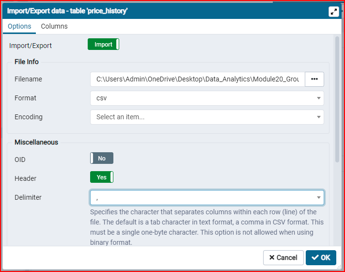
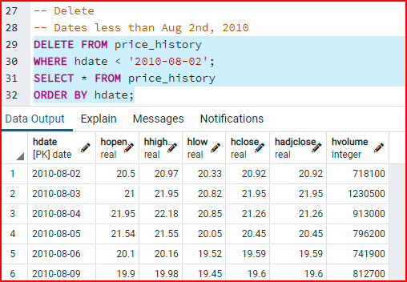

## Group : Data Incites

Our chosen dataset is located at the link below which has 10 years of historical daily Tesla stock prices.

Dataset : <https://www.kaggle.com/timoboz/tesla-stock-data-from-2010-to-2020>

## Segment 1 Deliverable

Role - Cirle -> Database Design and mockup

## Database table Creation

- The table creation script is included in this folder and is named "table_create_script.sql". This script was loaded into a query window and executed against a PostgreSQL database named "tesla", which was manually created using the pgAdmin interface.

## Table Attributes

- An ERD was not specifically created as we only have a singular data table with the following 7 attributes. I have provided a brief description of each below:
  - Date - this is the date of record
  - Open - opening price of stock
  - High - highest price recorded for that date
  - Low - lowest price recorded for that date
  - Close - closing price of stock
  - Adj Close - adjusted close in case of after hours trading
  - Volume - Amount of shares traded for that date

## Sample Data

- From the primary data downloaded from the kaggle site, I partitioned the sample data to be the top 100 rows from the actual source file including the header details. As such, we will be using real values for testing and preliminary analysis. This data was loaded manually into the database using the import feature of pgAdmin once the table was created as mentioned above. The name of the sample dat file is called "tesla100.csv"

## CRUD Testing

- With the database setup and available I decided to test everything using the CRUD concept reviewed during our course lectures. The file called "CRUD.txt" contains the SQL scripts that were developed to ensure the proper testing by CRUD functions. Below is a screen capture showing the final part of the delete process.

