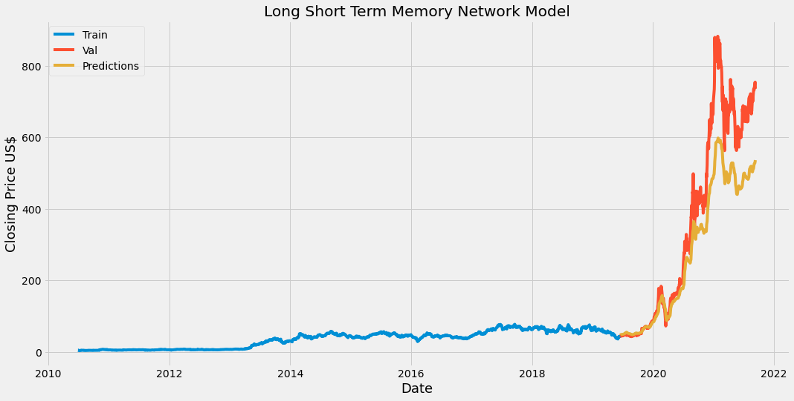
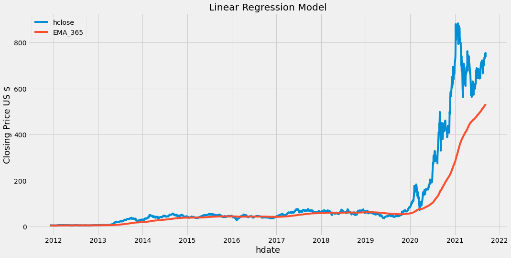

# Final Project

**Segment 2 Deliverable**

## Database Changes/Updates

- The database schema was updated to allow for a new table called 'common_values' which includes the quarterly data along with share price information on or before Tesla's quarterly dates.
- To facilitate the above table a new join was created using 'q_key' from the daily_price table to the common_values tables with 'q_id' as the primary key.
- There were a number of instances where the join did not match properly. After further review, it was found that these mismatches occurred because of situation where quarterly dates fall on a non-business day. For these values we manually selected the closest business day that matched the quarterly date but also occurred witin that quarter.

### Entity Relationship Diagram(ERD)

## Database connection

- The connection and retrieval starter code for the database was likewise updated with a tested sample retrieval and resides in the mlm2.p

## Machine Learning Models Reviewed

### Long Short Term Memory (LSTM) Network Model

### Regression

